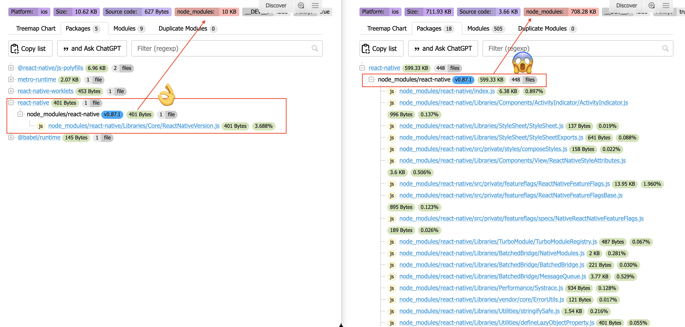

# babel-plugin-react-native-direct-imports

[](https://www.npmjs.com/package/babel-plugin-react-native-direct-imports)
[](https://www.npmtrends.com/babel-plugin-react-native-direct-imports)
[](https://www.npmjs.com/package/babel-plugin-react-native-direct-imports)

Babel plugin that rewrites named imports from `react-native` into direct imports of the underlying modules, so Metro doesn't have to load the whole `react-native` barrel file.

```js
import { View, AppRegistry, Systrace } from 'react-native';

// ↓ becomes

import View from 'react-native/Libraries/Components/View/View';
import { AppRegistry } from 'react-native/Libraries/ReactNative/AppRegistry';
import * as Systrace from 'react-native/Libraries/Performance/Systrace';
```

## Why

React Native's entry file (`react-native/index.js`) is a CommonJS barrel: one `module.exports` object with a lazy `require()` getter for every public API. The getters only delay running a module. Every module they reference still ends up in your bundle.

Bundlers can't tree-shake CommonJS getters. Metro doesn't tree-shake at all, and even [Re.Pack](https://re-pack.dev) with tree-shaking enabled can't remove them. So a single `import { View } from 'react-native'` pulls in all of React Native's public API, including modules your app probably never uses, like `VirtualView`, `UTFSequence` or `PushNotificationIOS`.

This plugin skips the barrel and imports each module directly, so only the modules you actually import end up in the bundle.

For example, here is a bundle that only does `import { ReactNativeVersion } from 'react-native'`, before and after:



## Install

```bash
npm install --save-dev babel-plugin-react-native-direct-imports
# or
yarn add -D babel-plugin-react-native-direct-imports
```

## Usage

Add the plugin to your `babel.config.js`:

```js
const isTest = process.env.NODE_ENV === 'test';

module.exports = {
  presets: [
    [
      'module:@react-native/babel-preset',
      {
        disableDeepImportWarnings: true,  // <-- add this, the plugin generates deep imports on purpose
      },
    ],
  ],
  plugins: [
    // Skip the plugin in test environments
    !isTest && [
      'react-native-direct-imports',
      { reactNativeVersion: require('react-native/package.json').version },
    ],
  ].filter(Boolean),
};
```

Then clear the Metro cache once:

```bash
npx react-native start --reset-cache
# or, with Expo
npx expo start --clear
```

### Options

| Option               | Type     | Default                       | Description                                                          |
| -------------------- | -------- | ----------------------------- | -------------------------------------------------------------------- |
| `reactNativeVersion` | `string` | latest map in [`maps/`](maps) | React Native version to use. Loads `maps/<reactNativeVersion>.json`. |

Maps are available for every stable React Native release from `0.70.0` on. The version must match a map exactly. If it doesn't, the build fails with an error listing the available versions. After upgrading React Native to a release that has no map yet, update this plugin as well.

## Notes

- Only names listed in the map are rewritten. Unknown names stay on the original `react-native` import.
- `unstable_batchedUpdates` has no module of its own since React Native 0.86 (it's a plain method in `index.js`), so it is inlined as `const unstable_batchedUpdates = (fn, bookkeeping) => fn(bookkeeping);`, matching React Native's implementation.
- Type-only imports (`import type { ... }`, `import { type ... }`) are left untouched.
- Metro's `Platform.OS` / `Platform.select` inlining (`inlinePlatform`) keeps working, as it matches the local name `Platform`. Aliased imports (`import { Platform as P }`) are not inlined.
- Aliases are preserved: `import { Text as RNText }` → `import RNText from 'react-native/Libraries/Text/Text'`.
- Re-exports are rewritten too: `export { findNodeHandle } from 'react-native'` → `const _findNodeHandle = require('react-native/Libraries/ReactNative/RendererProxy').findNodeHandle; export { _findNodeHandle as findNodeHandle };`. `export * from 'react-native'` is left untouched.
- `import * as RN from 'react-native'` throws a build error. Use named imports instead.
- The generated paths point to React Native internals (`Libraries/...`, `src/private/...`). They are not public API, which is why every React Native version has its own map.

## Generating maps (development)

Maps are generated from each version's `react-native/index.js`:

```bash
yarn generate-maps
# or for specific versions:
yarn generate-maps 0.87.1 0.86.3
```

## License

MIT
